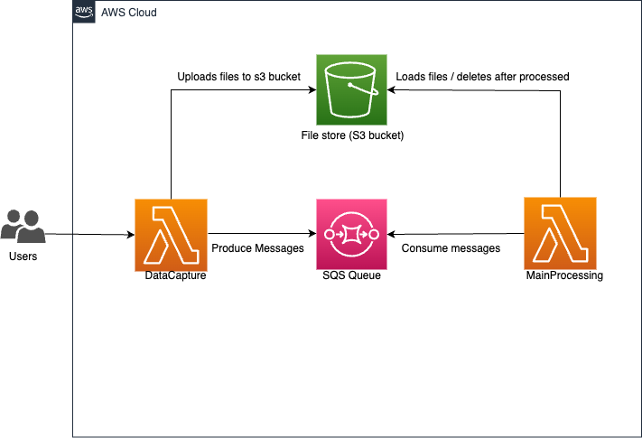

# Introduction

In this task we will create a system for continuous processing of scanned images.

Traditionally such systems consist of multiple independent services. Services could run on the same PC or multiple servers. For instance, the following setup could be applied:

Data capture service. Usually, data capture services have multiple instances installed on the multiple servers. The main purpose of these services is documents capturing and documents transferring next to the image transformation servers.
Image transformation services. Also, there can be multiple instances for balancing workload. Such services could perform the following image processing tasks like format converting, text recognition (OCR), sending to other document processing systems.
Main processing service. The purpose of the service is to monitor and control other services (data capturing and image transformation).
We will implement simplified model with 2 elements: Data capture service and Processing service.

#### Notes! Please discuss with you mentor the following details prior starting the task:

Which exact message queue to use (e.g., MSMQ/RabbitMQ/Kafka)

High-level solution architecture

* use console application as services

Collecting data processing results

Implement the main processing service that should do the following:

Create new queue on startup for receiving results from Data capture services.

Listen to the queue and store  all incoming messages in a local folder.

Implement Data capture service which will listen to a specific local folder and retrieve documents of some specific format (i.e., PDF) and send to Main processing service through message queue.

Try to experiment with your system like sending large files (300-500 Mb), if necessary, configure your system to use another format (i.e. .mp4).

For learning purposes assume that there could be multiple Data capture services, but we can have only one Processing server.

#### Notes

One of the challenges in this task is that we have a limit for message size. Message queues have limits for a single message size.

Please find one of the approaches to bypass this limitation by clicking the link:
Message Sequence
.

Discuss your solution with mentor.

Create UML diagram for the chosen solution (Component diagram).

http://draw.io/
- tool for drawing UML, approved freeware.


## Setup local environment:
1. [Install localstack](https://docs.localstack.cloud/getting-started/installation/)
2. [Install AWS CLI](https://docs.aws.amazon.com/cli/latest/userguide/getting-started-install.html)
3. (You can skip this step if you already have ~./aws/credentials file) Configure aws cli with dummy credentials using the command
```
aws configure
```
4. Start the localstack, using the command
```
localstack start
```
5. To create s3 bucket and sqs, you need to write the commands:
```
aws --endpoint-url=http://localhost:4566 s3api create-bucket --bucket sample-bucket
aws --endpoint-url=http://localhost:4566 sqs create-queue --queue-name sample-queue
```

## Diagram:


[Draw.io link](https://drive.google.com/file/d/16FtTgVJu4HGRkAPoJtk1uxrl4DzIzpxP/view?usp=sharing)